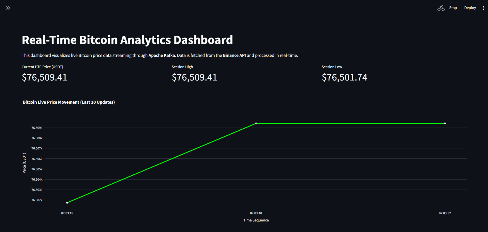
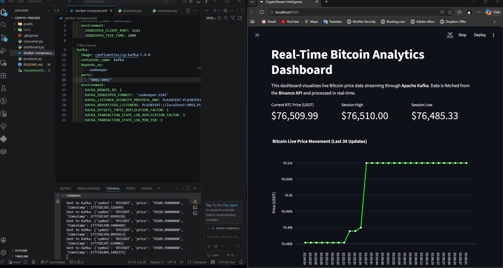
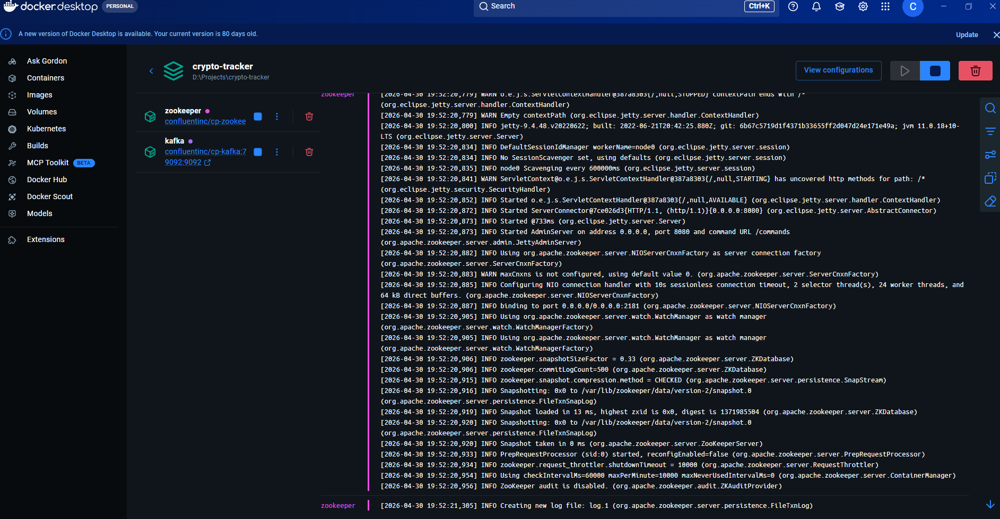

# ⚡ CryptoStream Intelligence: Real-Time Data Pipeline

[](https://www.python.org/)
[](https://kafka.apache.org/)
[](https://www.docker.com/)
[](https://streamlit.io/)

## 📖 Overview
This project is an **End-to-End Real-Time Data Engineering Pipeline** designed to ingest, process, and visualize live Bitcoin market data. By leveraging **Apache Kafka** as a distributed message broker, the system ensures low-latency data delivery from the **Binance API** to a custom-built analytics dashboard.

---

## 🏗️ System Architecture
The pipeline is built with a modular approach to ensure scalability and reliability:

1. **Ingestion Layer:** A Python-based Producer fetches live BTC/USDT tickers from Binance via REST API.
2. **Streaming Layer:** Apache Kafka manages the data stream through a dedicated `crypto-prices` topic, ensuring fault tolerance.
3. **Orchestration Layer:** Docker Compose handles the containerization of Kafka and Zookeeper for a "plug-and-play" infrastructure.
4. **Presentation Layer:** A Streamlit dashboard consumes the real-time stream, performing on-the-fly data transformations and rendering interactive Plotly charts.

---

## 🛠️ Technology Stack
| Category | Tools |
| :--- | :--- |
| **Language** | Python (Requests, Pandas, JSON) |
| **Streaming** | Apache Kafka, Zookeeper |
| **DevOps** | Docker, Docker Compose |
| **Visualization** | Streamlit, Plotly (Dynamic Charts) |
| **Data Source** | Binance Public API |

---

## 📊 Visual Preview

### 1. Real-Time Analytics Dashboard
The dashboard provides live price tracking and session-based high/low metrics.


### 2. Live Stream Processing
Synchronized communication between the Producer and Consumer terminals.


### 3. Containerized Infrastructure
Stable service management using Docker Desktop.


---

## 🚀 Getting Started

### Prerequisites
* [Docker Desktop](https://www.docker.com/products/docker-desktop/) installed and running.
* Python 3.8 or higher.

### Installation
1. **Clone the Repo:**
   ```bash
   git clone [https://github.com/chanakaekanayaka/crypto-realtime-pipeline.git](https://github.com/chanakaekanayaka/crypto-realtime-pipeline.git)
   cd crypto-realtime-pipeline